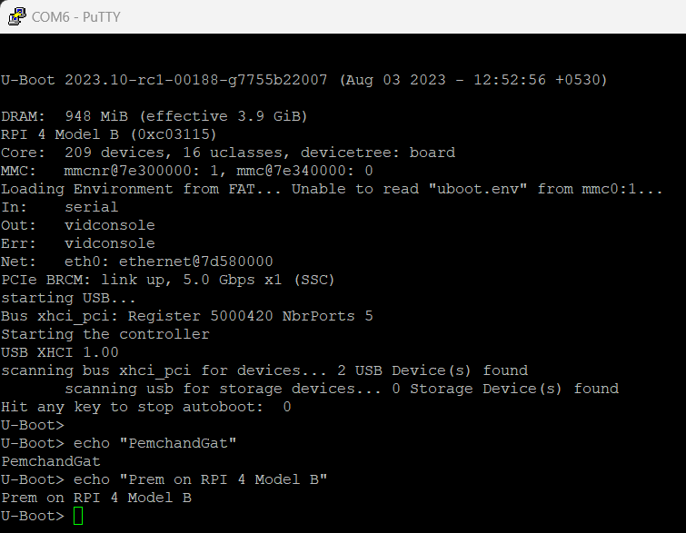

# U-BOOT on RPI 4 Model B

### Building u-boot.bin
> Note: Please read [this](https://github.com/PremchandGat/U-BOOT-RPI) and do initial setup needed to build u-boot.bin

***Now Run these following commands to inside the u-boot source code directory to build U-BOOT binary***
`prem@Ubuntu:~/Desktop/U-BOOT-RPI/u-boot$` **make clean**

`prem@Ubuntu:~/Desktop/U-BOOT-RPI/u-boot$` **CROSS_COMPILE=aarch64-linux-gnu- make rpi_4_defconfig**

`prem@Ubuntu:~/Desktop/U-BOOT-RPI/u-boot$` **CROSS_COMPILE=aarch64-linux-gnu- make -j6** 

## Create config.tx File
**File: config.txt**

enable_uart=1\
arm_64bit=1\
kernel=u-boot.bin

## Download Necessory files
Download bcm2711-rpi-4-b.dtb, fixup4.dat, start4.elf from [here](https://github.com/raspberrypi/firmware/tree/master/boot).

### Copy all the generated and downloaded files into the BOOT partition of SD card
BOOT partition of SD
<pre>BOOT/
|--  config.txt
|--  u-boot.bin
|--  bcm2711-rpi-4-b.dtb
|--  fixup4.dat
|--  start4.elf</pre>

All these files can be found under the directory Res/rpi-4-u-boot-files/

## Testing
[FTDI](https://ftdichip.com/products/ttl-232r-3v3-2mm/) and [Putty](https://putty.org/) is needed for serial communication.

**Raspberry Pi pin diagram**
 Image Credit: raspberrypi.com

Connect FTDI and RPI pins as below mentioned
<pre>RPI          --->  FTDI 
GPIO 14(TXD) --->  RX of FTDI
GPIO 15(RXD) --->  TX of FTDI
Ground       --->  Groung of FTDI</pre>
Once connection is done we are ready to connect to COM port of RPI via Putty to send commands and receive output.

